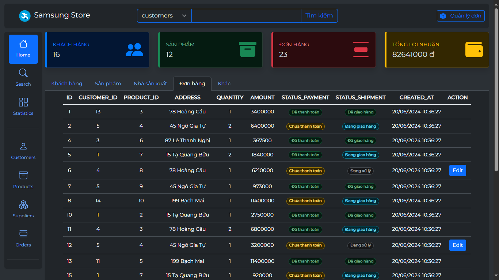

# Store Admin 
Trang web quản lý bán hàng

## Tech Stack

**Front-end:** HTML, Javascript, SCSS, Bootstrap 5

**Back-end:** NodeJS (ExpressJS)

**Database:** PostgreSQL


## Installation

Install NodeJS v20.12.2
```
https://nodejs.org/en/download/prebuilt-installer
```

Install npm
```bash
  npm install
```

PostgreSQL
```
src\app\controllers\SiteController.js
```

## Usage
Run project
```bash
npm start
```

Run to convert SCSS to CSS
```bash
npm run watch
```

## DEMO

#### Home



#### Search 
Search for products


####  Add 
Add orders with validation
> Before adding a product, ensure that a supplier exists. If the supplier doesn't exist, automatically add the supplier first, then proceed to add the product.


#### Edit 
Edit products with validation


####  Delete 
Delete with logic check in the database

 

#### Manage order 
Update order status, list orders that need refunds, list unpaid orders


#### Statistics 

